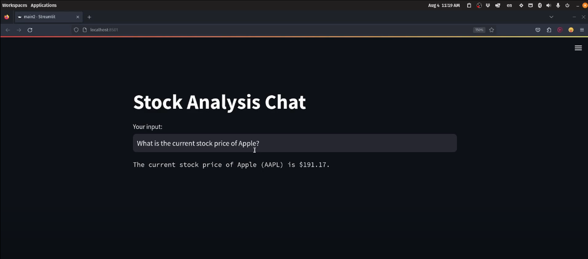
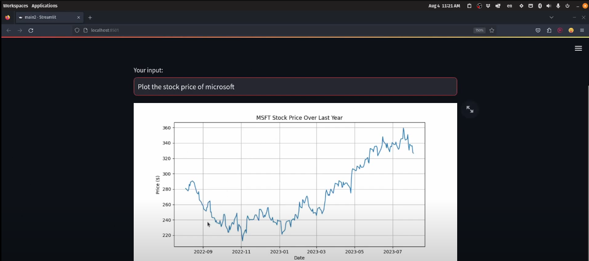

# AI Financial Stock Assistant

An interactive Streamlit-powered chatbot assistant for financial stock analysis, leveraging OpenAI’s GPT-4 and real-time market data via Yahoo Finance.



## Features

- **Conversational Stock Analysis:** Ask natural language questions about stocks and receive intelligent, actionable insights.
- **Technical Indicators:** Instantly calculate SMA, EMA, RSI, and MACD for any stock ticker.
- **Visualizations:** Generate and view historical price charts for any stock.
- **Secure API Key Management:** API key is loaded from a local file and excluded from version control.

## Example Plot



## Getting Started

### Prerequisites

- Python 3.8+
- [OpenAI API Key](https://platform.openai.com/account/api-keys)
- [Yahoo Finance](https://pypi.org/project/yfinance/)
- [Streamlit](https://streamlit.io/)
- [Matplotlib](https://matplotlib.org/)
- [Pandas](https://pandas.pydata.org/)

### Installation

1. **Clone the repository:**
   ```sh
   git clone https://github.com/yourusername/ai-financial-stock-assistant.git
   cd ai-financial-stock-assistant
   ```

2. **Install dependencies:**
   ```sh
   pip install -r requirements.txt
   ```

3. **Add your OpenAI API key:**
   - Create a file named `API_KEY` in the project root.
   - Paste your OpenAI API key inside.

### Running the App

```sh
streamlit run main.py
```

## Usage

- Enter your stock-related question in the chat box (e.g., “Show me the RSI for TSLA”).
- View computed indicators and price charts directly in the app.
- All conversations are securely managed in session state.

## Supported Functions

| Function            | Description                                              |
|---------------------|---------------------------------------------------------|
| `get_stock_price`   | Get the latest price for any stock ticker.              |
| `calculate_SMA`     | Compute Simple Moving Average for a given window.       |
| `calculate_EMA`     | Compute Exponential Moving Average for a given window.  |
| `calculate_RSI`     | Calculate Relative Strength Index.                      |
| `calculate_MACD`    | Calculate MACD and signal line.                         |
| `plot_stock_price`  | Visualize historical price chart for the last year.     |

## File Structure

```
main.py       # Streamlit app and core logic
API_KEY       # Your OpenAI API key (excluded from git)
.gitignore    # Ensures sensitive files are not tracked
```

## Security

- The `API_KEY` file is listed in `.gitignore` and never tracked by git.
- Never share your API key publicly.

## License

[MIT](LICENSE)

## Contributing

Pull requests and suggestions are welcome! Please open an issue first to discuss changes.

---

**Built with ❤️ by Subhadeep Roy**